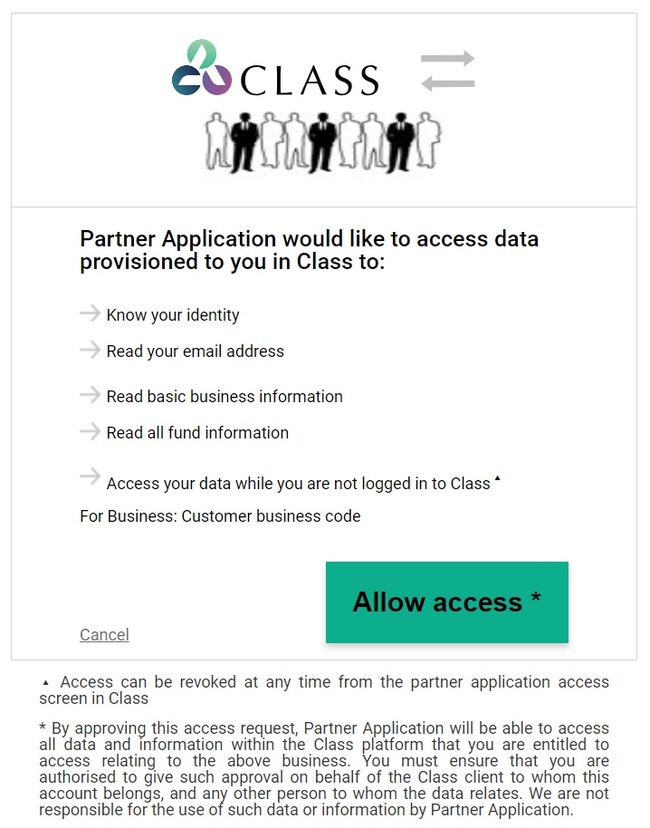
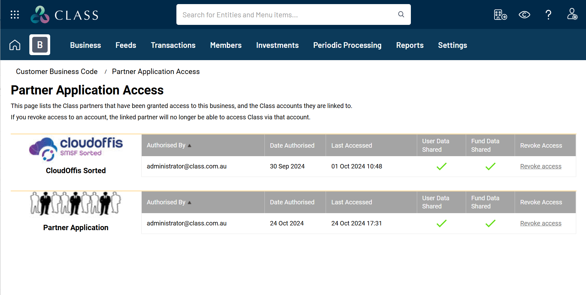

# Authorising Partner Application API Access

## Overview
This article describes how to grant API access to your data and how to revoke API access if you no longer want a Partner Application to have access to your data.

## Requesting Access via a Partner Application
All Partner applications are registered with Class and uniquely identify the Partner. Partner applications must request a Class user to grant API access to the Class business data. Only registered users (invited and accepted) of the business can grant access. Generally, users listed under **Business > Maintain Users** can provide access.

A Partner application can request access to your data while you are using the system (online access) or it can request access while you are no longer logged into the system (offline access). Depending on what data the Partner application wants to access (called scopes), the authorisation screen will display messages to inform you what access (scopes) is requested.

It is your responsibility to decide if you want to grant the Partner application that level of access or not. We recommend reaching out to the Partner to understand potential subscription fees for their products. The API access is provided at no cost to you, but the Partner may charge you for their service.

## Allowing/Granting Access
Example "Partner Application" requesting access to customer data using a few sample scopes.

Access can only be granted to one business at a time, so if your practice has multiple Class businesses, then you will have to grant access to each business.

## Access Scopes
| Scope | Meaning |
| :--- | :--- |
| **Know your identity** | Provides an ID token that can be used to uniquely identify a user (confirmed email address and current MFA performed). Generally used for SSO integrations with Partner applications. |
| **Read your basic information...** | Know the authorising user's first name, last name, email address, and recorded address as well as their class role in the business, i.e. fund administrator, tax agent, etc. |
| **Read summary fund information** | Able to obtain a list of funds for the business, including summarised information such as status, tags, latest period update, legal entity type and ABN if applicable. |
| **Read basic fund information** | Similar to above but only one fund at a time, including fund address details. |
| **Read member information** | Able to obtain a list of members and list of pension accounts. |
| **Read all fund information** | Read access to all fund level data that the user has access to (includes fund, member and pension information). |
| **Read and modify all fund information** | Read and write access to all fund level data that the user has access to. Will allow the application to modify or add information to Class. I.e. Load documents to fund DMS, update fund details, etc. |
| **Read basic business information** | Read information about users of the business (first name, middle name, last name, email address, role, scope granted and invitation status). |
| **Create new funds** | Ability to create new funds in the business, including loading fund reference data. |
| **Access your data while you are not logged into Class** | Ability to refresh all of the data relating to the granted scopes. |

## Review Partner Application Access
Navigate to **Business > Partner Application Access**.

Class records all the Partner Applications that have been granted offline access to your data. When a Partner Application is calling the Class APIs, we update the last accessed date.

## Revoking Partner Application Access
When you want to revoke access for a partner application:
1. Navigate to **Business > Partner Application Access**.
2. Select the relevant Partner Application.
3. Click on the **Revoke Access** link.

