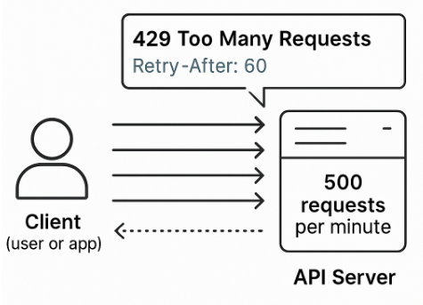

# Rate Limiting

## Overview
**Rate limiting** is a technique used to control the number of API requests a client can make to a server within a specific period. It helps pre**vent abuse, ensures fair usage, and protects our back-end systems from being overwhelmed.

- **Ensure fair access for all users**
- **Protect system stability and performance**
- **Protect system resources and improve scalability**
- **Avoid unexpected outages**

The Class platform enforces a rate limit of **500 endpoint calls per minute per OAuth client**. This ensures fair usage and system stability across all clients. Should you exceed this limit, your API calls will receive a `429` Too Many Requests response.

## Rate Limit Response Headers
When you make an API request, the response includes the following headers to help you track your usage:

| Response header | Description |
| :--- | :--- |
| `X-RateLimit-1Min-Remaining` | This header indicates the number of API calls you have left before you reach the rate limit for a one-minute period. It starts at 500. If this value drops to 0, subsequent API calls will receive a "429 Too Many Requests" error. |
| `X-RateLimit-ResetAfter` | This header tells you how many seconds you need to wait until your API rate limit resets to its initial value of 500 calls. It begins at 60 seconds and counts down, resetting the available calls once it reaches 0. |

## Handling a 429 Response
When your application receives a `429` **Too Many Requests** response, it has temporarily exceeded the allowed request volume. At this point, it’s essential that your application **immediately stops making further requests.**

Upon receiving a `429` response, your application should check for the `X-RateLimit-ResetAfter` header. This header indicates how many **seconds** your application must wait before sending another request. Your application **must always respect this header.**

By honouring the `X-RateLimit-ResetAfter` header, your application gracefully backs off, allowing the rate limit window to reset and helping prevent unnecessary strain on our systems.

## Rate Limiting for Serverless Technologies
With the rise of **modern serverless technologies**—such as **AWS Lambda**—API traffic is no longer tied to a single IP address, instead requests may originate from a wide range of dynamic sources. This article explains how to structure your AWS Lambda functions to stay within this limit while efficiently processing fund-related data.
-  Invoked an endpoint to **retrieve a list of all "Active" funds.**
-  Then, for each fund, call **additional endpoints** to fetch specific data (e.g., transactions, Investment related data, member contributions).

When working with fund-related data, it's common for each fund to trigger **multiple API calls**—typically between **5 to 7 calls per fund** depending on the business use case(s). To stay within the **500 calls per minute** limit, it's important to **queue your requests** and **structure your processing logic** accordingly. We suggest queuing calls per fund and not to exceed having more than 10 concurrent queues active at any one time.

## Rate Limit Strategy
To avoid exceeding the 500 calls/minute limit, we recommend:

- **Queue Fund Processing:** Group a small number of funds (e.g., 3–4) and process them together. This helps you control the total number of API calls per queue. (**Note:** A batch can be one fund, or a few funds depending on your use case)
- **Limit Concurrency:** Ensure that no more than a few queues are processed at the same time. This prevents spikes in traffic that could breach the rate limit.
- **Queue Responsibly:** While you may not use a formal queuing system, design your logic to **wait for one batch to complete before starting the next.**
- **Factor in Retries:** Retries due to errors or timeouts can increase your call volume. Always include a buffer in your calculations to account for this.
- **Adjust for Fund Complexity:** Some funds may require more data and therefore more API calls. Dynamically adjust your batch size based on the expected call volume per fund.

By following these principles, you can ensure your integration remains compliant with our platform’s rate limits while still delivering reliable and scalable performance.

## What's Next?
For more guidance, refer to AWS’s official For more guidance, refer to AWS’s official documentation on [AWS Lambda functions](https://docs.aws.amazon.com/lambda/latest/dg/lambda-concurrency.html).